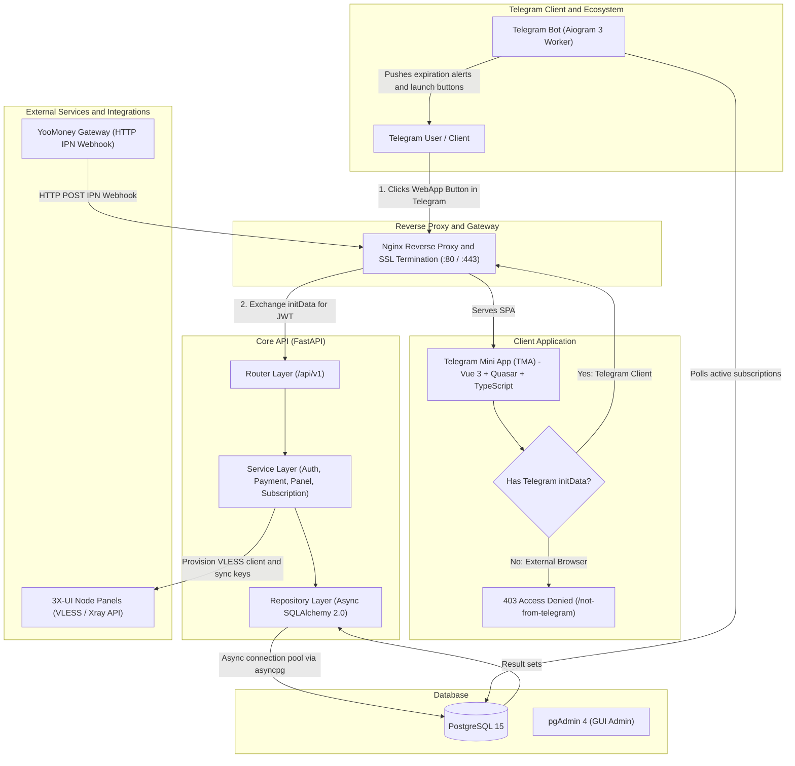

# Telegram Mini App VPN Ecosystem

<p align="center">
  <strong>Full-cycle Telegram Mini App & VPN Management Ecosystem</strong>
</p>

<p align="center">
  <a href="README.md"><b>English</b></a> | <a href="README.ru.md"><b>Русский</b></a>
</p>

<p align="center">
  
  
  
  
  
  
  
  
</p>

---

## 📖 Executive Summary

**Telegram Mini App VPN Ecosystem** is an enterprise-ready, self-hosted VPN management platform engineered specifically for seamless operation inside the Telegram ecosystem. The platform unifies a high-performance **FastAPI** backend, a native-styled **Vue 3 / Quasar** Telegram Mini App (TMA), and an asynchronous **Aiogram 3** notification and scheduler daemon.

The system automates the entire customer lifecycle:
1. **Telegram-Exclusive Zero-Trust Authentication**: The web application is isolated from direct public browser access. Upon opening, Quasar boot hooks extract and cryptographically verify Telegram WebApp `initData`. Access outside Telegram is barred with a `403 Access Denied` boundary (`/not-from-telegram`).
2. **Automated Billing & Invoicing**: Integrated with YooMoney merchant webhooks protected by SHA-1 signature verification.
3. **Instant VLESS/Xray Provisioning**: Direct synchronization with remote **3X-UI** panel nodes for automated user creation and credential distribution.
4. **Subscription Lifecycle Notifications**: Proactive reminders delivered by an Aiogram 3 worker at 3 days prior, 1 day prior, and upon expiration.

---

## 🏛️ System Architecture



---

## 🧱 Architecture Overview

### 1. Telegram WebApp Client (`tgbot_client`)
* **Framework**: [Vue 3](https://vuejs.org/) (Composition API, `<script setup>`), [Quasar Framework v2](https://quasar.dev/) (Vite bundler), and [TypeScript](https://www.typescriptlang.org/).
* **Strict Telegram Guard**:
  * On application boot (`src/boot/auth.ts`), the client checks `useWebApp().initData`.
  * If the app is launched in a standard browser outside the Telegram client context, it automatically redirects to `/not-from-telegram`, displaying a full-screen `403 Access Denied` barrier.
* **Native Telegram UX**: Utilizes [`vue-tg`](https://github.com/deptyped/vue-tg) to bridge native Telegram WebApp features: dynamic CSS theme matching (`tg-theme-bg-color`, `tg-theme-text-color`), native MainButton/BackButton controls, and haptic feedback.
* **Micro-interactions**: Integrated [Lottie](https://airbnb.io/lottie/) animations for delightful payment processing, success states, and empty placeholders.
* **Feature Set**:
  * One-tap configuration copy and deep links (`hiddify://`, `v2rayNG`, outline-compatible VLESS keys).
  * In-app balance top-up with real-time tariff calculations.
  * Multi-server location selector with dynamic flag indicators and ping status.
  * Native cross-platform connection tutorials for iOS, Android, macOS, and Windows.

### 2. Core API Service (`tgbot_server`)
* **Framework**: [FastAPI](https://fastapi.tiangolo.com/) powered by `uvicorn` with asynchronous request handling.
* **Clean Layered Architecture**:
  * **Routers (`app/api/v1/endpoints/`)**: Input validation, route declaration, dependency injection.
  * **Services (`app/services/`)**: Core business workflows (payment verification, protocol orchestration, client synchronization).
  * **Repositories (`app/repository/`)**: Encapsulated data-access patterns implementing abstract interfaces (`interfaces.py`).
  * **Schemas (`app/schema/`)**: Strict typing and validation using **Pydantic v2**.
* **Database & ORM**: **SQLAlchemy 2.0** utilizing `AsyncSession` with connection pooling via `asyncpg`. Database migrations are version-controlled with **Alembic**.

### 3. Background Automation Daemon (`tgbot_main`)
* **Framework**: [Aiogram 3.x](https://github.com/aiogram/aiogram) with asynchronous event loops.
* **Telegram Launchpad & Scheduler**:
  * Provides the `/start` command that delivers the inline `WebAppInfo` launch button linking directly to the hosted Mini App.
  * Continuously polls expiring subscriptions in PostgreSQL.
  * Delivers proactive alerts: **3 days prior**, **1 day prior**, and **upon expiration**.
  * Auto-disables expired clients in the database and pushes quick-renewal action buttons into user chats.

### 4. Third-Party Integrations
* **YooMoney Payment Gateway**:
  * Seamless invoice creation with custom redirect URLs.
  * Instant Payment Notification (IPN) webhook listener.
  * Strict cryptographic verification: calculates SHA-1 HMAC against shared `YOOMONEY_SECRET` to prevent fraud.
* **3X-UI REST API Node Manager**:
  * Automated user provisioning on remote VPN nodes.
  * Handles client addition, protocol UUID generation, inbound traffic limit allocation, and config retrieval.

---

## 🛡️ Key Engineering Highlights

| Category | Implementation Details |
| :--- | :--- |
| **Telegram-Only Access Boundary** | Frontend boot routing blocks any execution lacking Telegram environment variables, isolating sensitive customer dashboards from unauthorized web crawlers and direct browsers. |
| **Telegram `initData` Validation** | Backend cryptographic signature verification using HMAC-SHA256. Validates incoming query strings against the secret key derived from the Telegram Bot Token to prevent parameter tampering. |
| **JWT Authentication** | Issues signed RS256/HS256 Bearer JWTs upon verified Telegram login, enforced via FastAPI dependency injection guards (`get_current_active_user`). |
| **Webhook Integrity** | YooMoney webhooks are validated by computing an SHA-1 hash over parameters (`notification_type`, `operation_id`, `amount`, `currency`, `datetime`, `sender`, `codepro`, `secret`, `label`). |
| **Database Reliability** | ACID transaction management, explicit connection pool sizing via `asyncpg`, and declarative Alembic schema migration histories. |
| **Production Containerization** | Multi-stage Docker builds separating build-time dependencies from slim runtime images; unified orchestration via Docker Compose with automated service health dependencies (`wait-for-it.sh`). |
| **Reverse Proxy & Security** | Nginx terminates TLS/SSL (mandatory for Telegram WebApps), serves pre-compressed Quasar SPA static assets, and proxies API traffic with strict security headers and dotfile blocking. |

---

## 📡 API Documentation Summary

The FastAPI backend provides interactive Swagger/OpenAPI documentation accessible at `/api/docs`.

| Endpoint Group | Base Route | Description |
| :--- | :--- | :--- |
| **Authentication** | `/api/v1/auth` | Exchange Telegram `initData` credentials for a secure Bearer access token (`POST /login`). |
| **User Profile** | `/api/v1/user` | Retrieve user profile details, real-time balance, and Telegram profile avatar encoded as Base64. |
| **Subscriptions** | `/api/v1/subscription` | Fetch active user subscriptions grouped by target server nodes. |
| **3X-UI Panel Sync** | `/api/v1/panel` | Query remote node clients by UUID/email, provision new VLESS clients, and trigger manual node synchronization. |
| **Payment & Billing** | `/api/v1/payment` | Generate YooMoney payment URLs (`/new/yoomoney`), handle IPN webhooks (`/check/yoomoney`), and query transaction history. |
| **Server Nodes** | `/api/v1/server` | Retrieve active VPN server nodes, location metadata, and available connection parameters. |

---

## 📂 Repository Directory Layout

```
TelegramMiniAppBot/
├── docker-compose.yml       # Production container orchestration
├── nginx.conf               # Reverse proxy, SSL termination & SPA routing
├── .env.template            # Environment variable specification
├── tgbot_client/            # Frontend Single Page App (Vue 3 / Quasar / Vite)
│   ├── src/
│   │   ├── api/             # Typed API clients & Axios interceptors
│   │   ├── boot/            # Quasar boot scripts (Auth guard, Axios)
│   │   ├── components/      # UI widgets (Subscriptions, Payments, Cards)
│   │   ├── pages/           # Views (Connection, Billing, Catalog, Tutorials)
│   │   │   └── errors/      # NotFromTelegram.vue (403 Access Denied)
│   │   └── router/          # Client routing & navigation guards
│   └── Dockerfile           # Multi-stage Node/Nginx container build
├── tgbot_server/            # Backend Core Service (FastAPI)
│   ├── alembic/             # Versioned schema migrations
│   ├── app/
│   │   ├── api/v1/          # Endpoints (/auth, /user, /subscription, /payment, etc.)
│   │   ├── core/            # Config, database session, security, dependencies
│   │   ├── model/           # SQLAlchemy ORM declarative models
│   │   ├── repository/      # Database abstraction repositories
│   │   ├── schema/          # Pydantic validation schemas
│   │   ├── services/        # Business logic & 3X-UI/YooMoney integrations
│   │   └── utils/           # Cryptographic validators & helper utilities
│   └── Dockerfile           # Python 3.11 slim runtime container
└── tgbot_main/              # Telegram Notification Worker (Aiogram 3)
    ├── bot/
    │   ├── handlers/        # Bot commands (/start with WebAppInfo)
    │   ├── services/        # Expiration reminder & scheduler tasks
    │   └── repositories/    # Async database subscription query helpers
    └── Dockerfile           # Python daemon container
```

---

## 🚀 Setup & Deployment Guide

> [!IMPORTANT]
> **HTTPS Requirement**: Telegram WebApps strictly require a public **HTTPS** URL with a valid SSL certificate. In local development, you can expose the local port 443/80 using tools like **Cloudflare Tunnel**, **ngrok**, or **localtunnel**.

### Step 1: Telegram Bot & WebApp Registration
1. Open [@BotFather](https://t.me/BotFather) on Telegram and run `/newbot` to create your bot. Save the provided **Bot Token**.
2. Set up the Web App URL:
   * **Option A (Inline / Menu Button)**: Use `/setmenubutton`, select your bot, and enter your public HTTPS URL (e.g. `https://vpn.yourdomain.com`).
   * **Option B (Direct Mini App `/newapp`)**: Create a standalone Mini App alias linked to your bot and supply the URL.

### Step 2: Configure Environment Variables
Copy `.env.template` to `.env` in the root directory, as well as in `tgbot_server` and `tgbot_main`:

```bash
cp .env.template .env
```

Configure your parameters:

```env
# PostgreSQL Database Settings
POSTGRES_USER=postgres
POSTGRES_PASSWORD=your_secure_password
POSTGRES_DB=vpn_service_db

# Core Database Connection (for FastAPI & Bot)
DB_HOST=postgres
DB_PORT=5432
DB_NAME=vpn_service_db
DB_USER=postgres
DB_PASSWORD=your_secure_password

# pgAdmin Administration
PGADMIN_DEFAULT_EMAIL=admin@example.com
PGADMIN_DEFAULT_PASSWORD=admin_password

# Telegram Integration
BOT_TOKEN=1234567890:ABCdefGHIjklMNOpqrsTUVwxyz
TOKEN=1234567890:ABCdefGHIjklMNOpqrsTUVwxyz
WEBAPP_URL=https://vpn.yourdomain.com

# Security & JWT
JWT_SECRET_KEY=generate_a_random_64_char_secret_key_here
ACCESS_TOKEN_EXPIRE_MINUTES=43200

# YooMoney Merchant Integration
YOOMONEY_WALLET=41001XXXXXXXXXXX
YOOMONEY_SECRET=your_yoomoney_notification_secret
PAY_SUCCESS_URL=https://t.me/YourBotUsername/app

# 3X-UI Node Settings
TLS_VERIFY=False
```

### Step 3: SSL / TLS Certificate Configuration
Place your SSL certificates for Nginx inside `./ssl`:
* `./ssl/certificate.crt`
* `./ssl/private.key`

*(If using Let's Encrypt / Certbot, map your live certificate directory into `docker-compose.yml` under the `frontend` service).*

### Step 4: Launch via Docker Compose
Build and start all services with a single command:

```bash
docker compose up -d --build
```

The stack initializes in coordinated order:
1. **`postgres`**: Spins up the database and health checks port `5432`.
2. **`fastapi`**: `wait-for-it.sh` verifies DB availability, executes `alembic upgrade head` to run all pending migrations, and starts the API on port `8000`.
3. **`bot`**: Connects to the database and launches the Aiogram 3 worker with scheduled tasks.
4. **`frontend`**: Builds the optimized Quasar SPA and starts Nginx on `:80` and `:443`.
5. **`pgadmin`**: Accessible at `http://localhost:5050`.

### Step 5: Verification
1. Open your Telegram bot and send `/start`.
2. Click **"Запустить приложение 🚀"** (or use the persistent Menu button).
3. The Telegram Mini App will authenticate transparently via `initData` and open the dashboard.
4. *(Optional)* Try accessing `https://vpn.yourdomain.com` in a standard browser tab outside Telegram — you will see the `403 Access Denied` boundary screen, confirming strict context enforcement.

---

## 📄 License
This project is open-source and licensed under the **MIT License**.